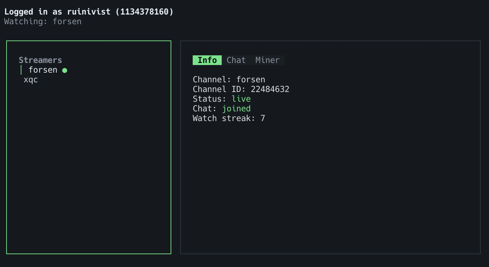
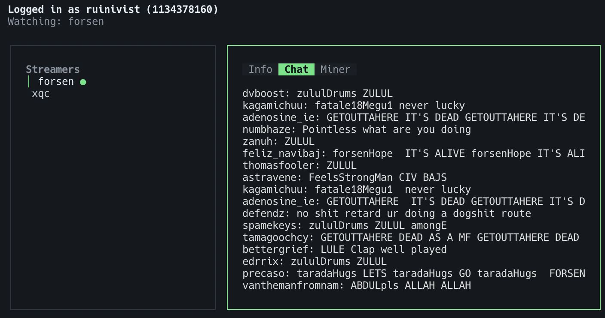
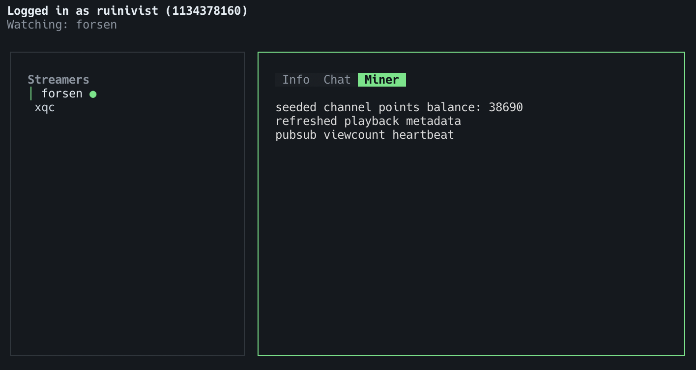

# parasocial

> Based on : https://github.com/rdavydov/Twitch-Channel-Points-Miner-v2

> Clanker disclosure : ALL of the code is GPT 5.5 generated

A cli only lightweight Twitch channel points miner.

### Installing

Install from aur
```
paru -S parasocial
yay -S parasocial
```

Or download a binary from releases.

### Config

Needs a `config.toml` at working directory with following shape
```toml
streamers = [ "streamer1", "streamer2" ]
```

The cli does not have a daemon mode, intended usage is with screen as following
```bash
screen -S parasocial # to create a session
parasocial # to start
# Ctrl a then d to detach
screen -r parasocial # to reattach
```

Usage: Arrow keys to move, q to quit.

### Screens




